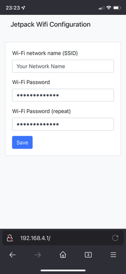

# OpenPyrojet Jetpack

This is the print head firmware project, designed for ESP32.

Developers can check out our [Development Docs](docs/development.md).

## Quick Overview

`Jetpack` is the print head firmware. When it starts up, you can configure it to use your Wi-Fi network (see "Using Jetpack" below).
`Jetpack` can be controlled by a front-end like [Jetpack.js](https://github.com/Sindry-Manufacturing/OpenPyrojet-Jetpack.js).
`Jetpack.js` can run on any web server or your local machine.

## Hardware Required

To run Jetpack, you need an ESP32 dev board (e.g. Wemos D1 Mini, ESP32-WROVER Kit) or ESP32 core board (e.g. ESP32-DevKitC).
The ESP32 must have `4 MB` of SPI flash memory on board.

The preferred board is a `Wemos Mini D1` with the `CP2104` USB-to-UART bridge.
Other boards tend to be less reliable when it comes to flashing. (see FAQ)

## Flashing Jetpack

### Linux

#### Pre-requisites

- `python 3.x`
- `jq` (run `pip install jq`)
- `esptool.py` (run `pip install esptool`)

#### Flashing

1. Unzip the package and open a terminal from this folder
2. Make the script executable: `chmod +x ./flash.sh`
2. Run `./flash.sh (DEVICE)` (where `(DEVICE)` is something like `/dev/ttyUSB0`)

### Windows

#### Pre-requisites

You must be able to run local PowerShell scripts:

```powershell
Set-ExecutionPolicy -ExecutionPolicy Unrestricted -Scope CurrentUser
```

(Optional) If you want to revert the execution policy, execute the following in an admin PowerShell:

```powershell
Set-ExecutionPolicy -ExecutionPolicy Undefined -Scope CurrentUser
```

You must have your ESP32 recognized in the `Device Manager`. It should show a COM port.

If your ESP32 isn't recognized, install the driver from [Silabs](https://www.silabs.com/developers/usb-to-uart-bridge-vcp-drivers).

#### Flashing

1. Unzip the package. 
2. In PowerShell: run `./flash.ps1 (PORT)` (where `(PORT)` is something like `COM1`/`COM2`/...)

## Using Jetpack

Once you have installed the firmware on your ESP32, Jetpack will appear as a Wi-Fi access point:


Connect to it using the password `openpyrojet`.

Once connected, click on the connection information to find out the "Router IP". It will look like `192.168.4.1`.

The next step is to open the web browser. Surf to `http://192.168.4.1`.
Make sure to substitute the address with the router IP from the Wi-Fi settings.



When you pressed save, you should see a popup that confirms it.

Now reboot the ESP32. It should connect to your Wi-Fi network.

You can now use [Jetpack.js](https://github.com/Sindry-Manufacturing/OpenPyrojet-Jetpack.js) to connect to the device from your phone/laptop/desktop.

## FAQ

- Q: The ESP32 is stuck "Connecting..." while trying to flash the firmware.
- A: Some ESP32 devices have a different USB/UART implementation. To flash, press the "boot" or "reset" button every 1 to 2 seconds until firmware flashing continues.

## License

[GNU General Public License Version 3](LICENSE.md)
